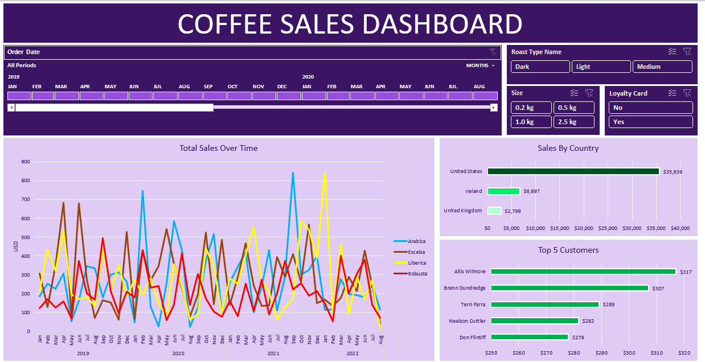

# 📊 Excel Data Analysis Projects

A collection of professional Excel-based data analysis projects that showcase strong analytical, visualization, and dashboard-building skills.  
Each project demonstrates real-world business insights through data cleaning, pivot tables, charts, and dynamic dashboards.

---

## ☕ Coffee Sales Excel Dashboard

### 📘 Project Description
Analyzes coffee sales performance across multiple regions and products over a period of time.  
The goal is to gain actionable insights and present them in an **interactive Excel dashboard**.

### 📁 Files Included
- `Coffee_Sales_Data.xlsx` – Raw dataset (Region, Product, Quantity, Sales, Date)
- `Coffee_Sales_Dashboard.xlsx` – Processed data and dashboard
- `images/coffee_dashboard_preview.png` – Dashboard preview
- `README.md` – Project overview

### 📊 Key Features
- Data cleaning and structuring
- Pivot Tables and Charts
- Slicers, Timelines & Conditional Formatting
- KPIs such as:
  - Total Sales  
  - Top Products  
  - Best Regions  
  - Monthly Trends  

### 🖼️ Dashboard Preview

### 📈 Sample Insights
- **Total Sales:** ₹5,32,000  
- **Top Product:** Cappuccino  
- **Best Region:** South  
- **Peak Sales Month:** March  

### 🛠 Tools Used
- Microsoft Excel (365 or 2019+)
- Pivot Tables & Charts
- Excel Formulas (SUMIFS, IF, XLOOKUP)
- Data Cleaning & Dashboard Design

---

## 🛒 Blinkit Sales Analysis Dashboard (IIT Project)

### 📘 Project Description
An advanced Excel project analyzing Blinkit’s product sales and operational performance.  
Built as part of an **IIT-based Data Analytics learning project**, this dashboard converts raw sales data into clear business insights.

### 📁 Files Included
- `Blinkit_Sales_Data.xlsx` – Raw dataset
- `Blinkit_Sales_Dashboard.xlsx` – Processed data with KPIs and visualization
- `images/blinkit_dashboard_preview.png` – Dashboard image
- `README.md` – Documentation

### 📊 Key Features
- Complete data cleaning workflow (Power Query + Excel)
- KPI-driven dashboard for:
  - Total Orders  
  - Average Delivery Time  
  - Category-wise Revenue  
  - Customer Ratings Distribution  
- Use of advanced Excel formulas, charts, and data modeling
- Insights useful for e-commerce operations and delivery optimization

### 🖼️ Dashboard Preview
<!--  -->

### 📈 Sample Insights
- **Highest Selling Category:** Beverages  
- **Top City:** Mumbai  
- **Average Delivery Time:** 22 mins  
- **Peak Order Month:** August  

### 🛠 Tools Used
- Microsoft Excel (Power Query)
- Pivot Charts
- Conditional Formatting
- Slicers & Data Visualization

---

## 🎯 Learning Outcomes
- Clean, transform, and visualize datasets in Excel
- Build dashboards for real-world business use cases
- Demonstrate analytics skills for job interviews or portfolio

---

## 👨‍💻 Author
**Muthuswamy Nadar**  
🔗 [LinkedIn](https://www.linkedin.com/in/nadarmuthuswamy/)

---

## ⭐ Support
If you find these projects helpful, please ⭐ the repository to support future Excel & Data Analytics work!
